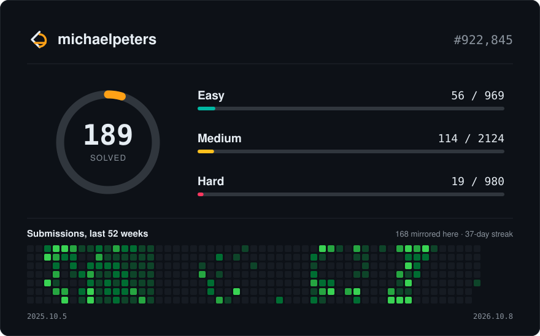

# LeetCode Solutions

  

  
  
  
  

Solutions mirrored from LeetCode by [GleetCode](https://github.com/michaelpeters-dev/leetcode), a Chrome extension that commits each accepted submission as I solve it.

**Languages** — C++ 1

## Solutions

| # | Problem | Difficulty | Language | Solved | Source |
|--:|:--------|:----------:|:---------|:-------|:-------|
| 1 | [Two Sum](https://leetcode.com/problems/two-sum/) |  | — | — | [1_two_sum.py](solutions/1_two_sum.py) |
| 2 | [Add Two Numbers](https://leetcode.com/problems/add-two-numbers/) |  | — | — | [2_add_two_numbers.py](solutions/2_add_two_numbers.py) |
| 3 | [Longest Substring Without Repeating Characters](https://leetcode.com/problems/longest-substring-without-repeating-characters/) |  | — | — | [3_longest_substring_without_repeating_characters.py](solutions/3_longest_substring_without_repeating_characters.py) |
| 4 | [Median Of Two Sorted Arrays](https://leetcode.com/problems/median-of-two-sorted-arrays/) |  | — | — | [4_median_of_two_sorted_arrays.py](solutions/4_median_of_two_sorted_arrays.py) |
| 5 | [Longest Palindromic Substring](https://leetcode.com/problems/longest-palindromic-substring/) |  | — | — | [5_longest_palindromic_substring.py](solutions/5_longest_palindromic_substring.py) |
| 6 | [Zigzag Conversion](https://leetcode.com/problems/zigzag-conversion/) |  | — | — | [6_zigzag_conversion.py](solutions/6_zigzag_conversion.py) |
| 7 | [Reverse Integer](https://leetcode.com/problems/reverse-integer/) |  | — | — | [7_reverse_integer.py](solutions/7_reverse_integer.py) |
| 9 | [Palindrome Number](https://leetcode.com/problems/palindrome-number/) |  | — | — | [9_palindrome_number.py](solutions/9_palindrome_number.py) |
| 10 | [Regular Expression Matching](https://leetcode.com/problems/regular-expression-matching/) |  | — | — | [10_regular_expression_matching.py](solutions/10_regular_expression_matching.py) |
| 11 | [Container With Most Water](https://leetcode.com/problems/container-with-most-water/) |  | — | — | [11_container_with_most_water.py](solutions/11_container_with_most_water.py) |
| 13 | [Roman To Integer](https://leetcode.com/problems/roman-to-integer/) |  | — | — | [13_roman_to_integer.py](solutions/13_roman_to_integer.py) |
| 14 | [Longest Common Prefix](https://leetcode.com/problems/longest-common-prefix/) |  | — | — | [14_longest_common_prefix.py](solutions/14_longest_common_prefix.py) |
| 15 | [3sum](https://leetcode.com/problems/3sum/) |  | — | — | [15_3sum.py](solutions/15_3sum.py) |
| 17 | [Letter Combinations Of A Phone Number](https://leetcode.com/problems/letter-combinations-of-a-phone-number/) |  | — | — | [17_letter_combinations_of_a_phone_number.py](solutions/17_letter_combinations_of_a_phone_number.py) |
| 19 | [Remove Nth Node From End Of List](https://leetcode.com/problems/remove-nth-node-from-end-of-list/) |  | — | — | [19_remove_nth_node_from_end_of_list.py](solutions/19_remove_nth_node_from_end_of_list.py) |
| 20 | [Valid Parentheses](https://leetcode.com/problems/valid-parentheses/) |  | — | — | [20_valid_parentheses.py](solutions/20_valid_parentheses.py) |
| 21 | [Merge Two Sorted Lists](https://leetcode.com/problems/merge-two-sorted-lists/) |  | — | — | [21_merge_two_sorted_lists.py](solutions/21_merge_two_sorted_lists.py) |
| 22 | [Generate Parentheses](https://leetcode.com/problems/generate-parentheses/) |  | — | — | [22_generate_parentheses.py](solutions/22_generate_parentheses.py) |
| 23 | [Merge K Sorted Lists](https://leetcode.com/problems/merge-k-sorted-lists/) |  | — | — | [23_merge_k_sorted_lists.py](solutions/23_merge_k_sorted_lists.py) |
| 25 | [Reverse Nodes In K Group](https://leetcode.com/problems/reverse-nodes-in-k-group/) |  | — | — | [25_reverse_nodes_in_k_group.py](solutions/25_reverse_nodes_in_k_group.py) |
| 26 | [Remove Duplicates From Sorted Array](https://leetcode.com/problems/remove-duplicates-from-sorted-array/) |  | — | — | [26_remove_duplicates_from_sorted_array.py](solutions/26_remove_duplicates_from_sorted_array.py) |
| 27 | [Remove Element](https://leetcode.com/problems/remove-element/) |  | — | — | [27_remove_element.py](solutions/27_remove_element.py) |
| 28 | [Find The Index Of The First Occurrence In A String](https://leetcode.com/problems/find-the-index-of-the-first-occurrence-in-a-string/) |  | — | — | [28_find_the_index_of_the_first_occurrence_in_a_string.py](solutions/28_find_the_index_of_the_first_occurrence_in_a_string.py) |
| 33 | [Search In Rotated Sorted Array](https://leetcode.com/problems/search-in-rotated-sorted-array/) |  | — | — | [33_search_in_rotated_sorted_array.py](solutions/33_search_in_rotated_sorted_array.py) |
| 35 | [Search Insert Position](https://leetcode.com/problems/search-insert-position/) |  | — | — | [35_search_insert_position.py](solutions/35_search_insert_position.py) |
| 36 | [Valid Sudoku](https://leetcode.com/problems/valid-sudoku/) |  | — | — | [36_valid_sudoku.py](solutions/36_valid_sudoku.py) |
| 39 | [Combination Sum](https://leetcode.com/problems/combination-sum/) |  | — | — | [39_combination_sum.py](solutions/39_combination_sum.py) |
| 40 | [Combination Sum Ii](https://leetcode.com/problems/combination-sum-ii/) |  | — | — | [40_combination_sum_ii.py](solutions/40_combination_sum_ii.py) |
| 42 | [Trapping Rain Water](https://leetcode.com/problems/trapping-rain-water/) |  | — | — | [42_trapping_rain_water.py](solutions/42_trapping_rain_water.py) |
| 43 | [Multiply Strings](https://leetcode.com/problems/multiply-strings/) |  | — | — | [43_multiply_strings.py](solutions/43_multiply_strings.py) |
| 45 | [Jump Game Ii](https://leetcode.com/problems/jump-game-ii/) |  | — | — | [45_jump_game_ii.py](solutions/45_jump_game_ii.py) |
| 46 | [Permutations](https://leetcode.com/problems/permutations/) |  | — | — | [46_permutations.py](solutions/46_permutations.py) |
| 48 | [Rotate Image](https://leetcode.com/problems/rotate-image/) |  | — | — | [48_rotate_image.py](solutions/48_rotate_image.py) |
| 49 | [Group Anagrams](https://leetcode.com/problems/group-anagrams/) |  | — | — | [49_group_anagrams.py](solutions/49_group_anagrams.py) |
| 50 | [Powx N](https://leetcode.com/problems/powx-n/) |  | — | — | [50_powx_n.py](solutions/50_powx_n.py) |
| 51 | [N Queens](https://leetcode.com/problems/n-queens/) |  | — | — | [51_n_queens.py](solutions/51_n_queens.py) |
| 53 | [Maximum Subarray](https://leetcode.com/problems/maximum-subarray/) |  | — | — | [53_maximum_subarray.py](solutions/53_maximum_subarray.py) |
| 54 | [Spiral Matrix](https://leetcode.com/problems/spiral-matrix/) |  | — | — | [54_spiral_matrix.py](solutions/54_spiral_matrix.py) |
| 55 | [Jump Game](https://leetcode.com/problems/jump-game/) |  | — | — | [55_jump_game.py](solutions/55_jump_game.py) |
| 56 | [Merge Intervals](https://leetcode.com/problems/merge-intervals/) |  | — | — | [56_merge_intervals.py](solutions/56_merge_intervals.py) |
| 57 | [Insert Interval](https://leetcode.com/problems/insert-interval/) |  | — | — | [57_insert_interval.py](solutions/57_insert_interval.py) |
| 58 | [Length Of Last Word](https://leetcode.com/problems/length-of-last-word/) |  | — | — | [58_length_of_last_word.py](solutions/58_length_of_last_word.py) |
| 62 | [Unique Paths](https://leetcode.com/problems/unique-paths/) |  | — | — | [62_unique_paths.py](solutions/62_unique_paths.py) |
| 63 | [Unique Paths Ii](https://leetcode.com/problems/unique-paths-ii/) |  | — | — | [63_unique_paths_ii.py](solutions/63_unique_paths_ii.py) |
| 66 | [Plus One](https://leetcode.com/problems/plus-one/) |  | — | — | [66_plus_one.py](solutions/66_plus_one.py) |
| 69 | [Sqrtx](https://leetcode.com/problems/sqrtx/) |  | — | — | [69_sqrtx.py](solutions/69_sqrtx.py) |
| 70 | [Climbing Stairs](https://leetcode.com/problems/climbing-stairs/) |  | — | — | [70_climbing_stairs.py](solutions/70_climbing_stairs.py) |
| 72 | [Edit Distance](https://leetcode.com/problems/edit-distance/) |  | — | — | [72_edit_distance.py](solutions/72_edit_distance.py) |
| 74 | [Search A 2d Matrix](https://leetcode.com/problems/search-a-2d-matrix/) |  | — | — | [74_search_a_2d_matrix.py](solutions/74_search_a_2d_matrix.py) |
| 76 | [Minimum Window Substring](https://leetcode.com/problems/minimum-window-substring/) |  | — | — | [76_minimum_window_substring.py](solutions/76_minimum_window_substring.py) |
| 77 | [Combinations](https://leetcode.com/problems/combinations/) |  | — | — | [77_combinations.py](solutions/77_combinations.py) |
| 78 | [Subsets](https://leetcode.com/problems/subsets/) |  | — | — | [78_subsets.py](solutions/78_subsets.py) |
| 79 | [Word Search](https://leetcode.com/problems/word-search/) |  | — | — | [79_word_search.py](solutions/79_word_search.py) |
| 83 | [Remove Duplicates From Sorted List](https://leetcode.com/problems/remove-duplicates-from-sorted-list/) |  | — | — | [83_remove_duplicates_from_sorted_list.py](solutions/83_remove_duplicates_from_sorted_list.py) |
| 84 | [Largest Rectangle In Histogram](https://leetcode.com/problems/largest-rectangle-in-histogram/) |  | — | — | [84_largest_rectangle_in_histogram.py](solutions/84_largest_rectangle_in_histogram.py) |
| 90 | [Subsets Ii](https://leetcode.com/problems/subsets-ii/) |  | — | — | [90_subsets_ii.py](solutions/90_subsets_ii.py) |
| 91 | [Decode Ways](https://leetcode.com/problems/decode-ways/) |  | — | — | [91_decode_ways.py](solutions/91_decode_ways.py) |
| 94 | [Binary Tree Inorder Traversal](https://leetcode.com/problems/binary-tree-inorder-traversal/) |  | — | — | [94_binary_tree_inorder_traversal.py](solutions/94_binary_tree_inorder_traversal.py) |
| 97 | [Interleaving String](https://leetcode.com/problems/interleaving-string/) |  | — | — | [97_interleaving_string.py](solutions/97_interleaving_string.py) |
| 98 | [Validate Binary Search Tree](https://leetcode.com/problems/validate-binary-search-tree/) |  | — | — | [98_validate_binary_search_tree.py](solutions/98_validate_binary_search_tree.py) |
| 100 | [Same Tree](https://leetcode.com/problems/same-tree/) |  | — | — | [100_same_tree.py](solutions/100_same_tree.py) |
| 101 | [Symmetric Tree](https://leetcode.com/problems/symmetric-tree/) |  | — | — | [101_symmetric_tree.py](solutions/101_symmetric_tree.py) |
| 102 | [Binary Tree Level Order Traversal](https://leetcode.com/problems/binary-tree-level-order-traversal/) |  | — | — | [102_binary_tree_level_order_traversal.py](solutions/102_binary_tree_level_order_traversal.py) |
| 104 | [Maximum Depth Of Binary Tree](https://leetcode.com/problems/maximum-depth-of-binary-tree/) |  | — | — | [104_maximum_depth_of_binary_tree.py](solutions/104_maximum_depth_of_binary_tree.py) |
| 105 | [Construct Binary Tree From Preorder And Inorder Traversal](https://leetcode.com/problems/construct-binary-tree-from-preorder-and-inorder-traversal/) |  | — | — | [105_construct_binary_tree_from_preorder_and_inorder_traversal.py](solutions/105_construct_binary_tree_from_preorder_and_inorder_traversal.py) |
| 110 | [Balanced Binary Tree](https://leetcode.com/problems/balanced-binary-tree/) |  | — | — | [110_balanced_binary_tree.py](solutions/110_balanced_binary_tree.py) |
| 112 | [Path Sum](https://leetcode.com/problems/path-sum/) |  | — | — | [112_path_sum.py](solutions/112_path_sum.py) |
| 115 | [Distinct Subsequences](https://leetcode.com/problems/distinct-subsequences/) |  | — | — | [115_distinct_subsequences.py](solutions/115_distinct_subsequences.py) |
| 121 | [Best Time To Buy And Sell Stock](https://leetcode.com/problems/best-time-to-buy-and-sell-stock/) |  | — | — | [121_best_time_to_buy_and_sell_stock.py](solutions/121_best_time_to_buy_and_sell_stock.py) |
| 124 | [Binary Tree Maximum Path Sum](https://leetcode.com/problems/binary-tree-maximum-path-sum/) |  | — | — | [124_binary_tree_maximum_path_sum.py](solutions/124_binary_tree_maximum_path_sum.py) |
| 125 | [Valid Palindrome](https://leetcode.com/problems/valid-palindrome/) |  | — | — | [125_valid_palindrome.py](solutions/125_valid_palindrome.py) |
| 127 | [Word Ladder](https://leetcode.com/problems/word-ladder/) |  | — | — | [127_word_ladder.py](solutions/127_word_ladder.py) |
| 128 | [Longest Consecutive Sequence](https://leetcode.com/problems/longest-consecutive-sequence/) |  | — | — | [128_longest_consecutive_sequence.py](solutions/128_longest_consecutive_sequence.py) |
| 130 | [Surrounded Regions](https://leetcode.com/problems/surrounded-regions/) |  | — | — | [130_surrounded_regions.py](solutions/130_surrounded_regions.py) |
| 131 | [Palindrome Partitioning](https://leetcode.com/problems/palindrome-partitioning/) |  | — | — | [131_palindrome_partitioning.py](solutions/131_palindrome_partitioning.py) |
| 133 | [Clone Graph](https://leetcode.com/problems/clone-graph/) |  | — | — | [133_clone_graph.py](solutions/133_clone_graph.py) |
| 134 | [Gas Station](https://leetcode.com/problems/gas-station/) |  | — | — | [134_gas_station.py](solutions/134_gas_station.py) |
| 136 | [Single Number](https://leetcode.com/problems/single-number/) |  | — | — | [136_single_number.py](solutions/136_single_number.py) |
| 138 | [Copy List With Random Pointer](https://leetcode.com/problems/copy-list-with-random-pointer/) |  | — | — | [138_copy_list_with_random_pointer.py](solutions/138_copy_list_with_random_pointer.py) |
| 139 | [Word Break](https://leetcode.com/problems/word-break/) |  | — | — | [139_word_break.py](solutions/139_word_break.py) |
| 141 | [Linked List Cycle](https://leetcode.com/problems/linked-list-cycle/) |  | — | — | [141_linked_list_cycle.py](solutions/141_linked_list_cycle.py) |
| 142 | [Linked List Cycle Ii](https://leetcode.com/problems/linked-list-cycle-ii/) |  | — | — | [142_linked_list_cycle_ii.py](solutions/142_linked_list_cycle_ii.py) |
| 143 | [Reorder List](https://leetcode.com/problems/reorder-list/) |  | — | — | [143_reorder_list.py](solutions/143_reorder_list.py) |
| 144 | [Binary Tree Preorder Traversal](https://leetcode.com/problems/binary-tree-preorder-traversal/) |  | — | — | [144_binary_tree_preorder_traversal.py](solutions/144_binary_tree_preorder_traversal.py) |
| 146 | [Lru Cache](https://leetcode.com/problems/lru-cache/) |  | — | — | [146_lru_cache.py](solutions/146_lru_cache.py) |
| 150 | [Evaluate Reverse Polish Notation](https://leetcode.com/problems/evaluate-reverse-polish-notation/) |  | — | — | [150_evaluate_reverse_polish_notation.py](solutions/150_evaluate_reverse_polish_notation.py) |
| 152 | [Maximum Product Subarray](https://leetcode.com/problems/maximum-product-subarray/) |  | — | — | [152_maximum_product_subarray.py](solutions/152_maximum_product_subarray.py) |
| 153 | [Find Minimum In Rotated Sorted Array](https://leetcode.com/problems/find-minimum-in-rotated-sorted-array/) |  | — | — | [153_find_minimum_in_rotated_sorted_array.py](solutions/153_find_minimum_in_rotated_sorted_array.py) |
| 155 | [Min Stack](https://leetcode.com/problems/min-stack/) |  | — | — | [155_min_stack.py](solutions/155_min_stack.py) |
| 160 | [Intersection Of Two Linked Lists](https://leetcode.com/problems/intersection-of-two-linked-lists/) |  | — | — | [160_intersection_of_two_linked_lists.py](solutions/160_intersection_of_two_linked_lists.py) |
| 167 | [Two Sum Ii Input Array Is Sorted](https://leetcode.com/problems/two-sum-ii-input-array-is-sorted/) |  | — | — | [167_two_sum_ii_input_array_is_sorted.py](solutions/167_two_sum_ii_input_array_is_sorted.py) |
| 190 | [Reverse Bits](https://leetcode.com/problems/reverse-bits/) |  | — | — | [190_reverse_bits.py](solutions/190_reverse_bits.py) |
| 191 | [Number Of 1 Bits](https://leetcode.com/problems/number-of-1-bits/) |  | — | — | [191_number_of_1_bits.py](solutions/191_number_of_1_bits.py) |
| 198 | [House Robber](https://leetcode.com/problems/house-robber/) |  | — | — | [198_house_robber.py](solutions/198_house_robber.py) |
| 199 | [Binary Tree Right Side View](https://leetcode.com/problems/binary-tree-right-side-view/) |  | — | — | [199_binary_tree_right_side_view.py](solutions/199_binary_tree_right_side_view.py) |
| 200 | [Number Of Islands](https://leetcode.com/problems/number-of-islands/) |  | — | — | [200_number_of_islands.py](solutions/200_number_of_islands.py) |
| 202 | [Happy Number](https://leetcode.com/problems/happy-number/) |  | — | — | [202_happy_number.py](solutions/202_happy_number.py) |
| 203 | [Remove Linked List Elements](https://leetcode.com/problems/remove-linked-list-elements/) |  | — | — | [203_remove_linked_list_elements.py](solutions/203_remove_linked_list_elements.py) |
| 206 | [Reverse Linked List](https://leetcode.com/problems/reverse-linked-list/) |  | — | — | [206_reverse_linked_list.py](solutions/206_reverse_linked_list.py) |
| 207 | [Course Schedule](https://leetcode.com/problems/course-schedule/) |  | — | — | [207_course_schedule.py](solutions/207_course_schedule.py) |
| 208 | [Implement Trie Prefix Tree](https://leetcode.com/problems/implement-trie-prefix-tree/) |  | — | — | [208_implement_trie_prefix_tree.py](solutions/208_implement_trie_prefix_tree.py) |
| 209 | [Minimum Size Subarray Sum](https://leetcode.com/problems/minimum-size-subarray-sum/) |  | — | — | [209_minimum_size_subarray_sum.py](solutions/209_minimum_size_subarray_sum.py) |
| 210 | [Course Schedule Ii](https://leetcode.com/problems/course-schedule-ii/) |  | — | — | [210_course_schedule_ii.py](solutions/210_course_schedule_ii.py) |
| 211 | [Design Add And Search Words Data Structure](https://leetcode.com/problems/design-add-and-search-words-data-structure/) |  | — | — | [211_design_add_and_search_words_data_structure.py](solutions/211_design_add_and_search_words_data_structure.py) |
| 212 | [Word Search Ii](https://leetcode.com/problems/word-search-ii/) |  | — | — | [212_word_search_ii.py](solutions/212_word_search_ii.py) |
| 213 | [House Robber Ii](https://leetcode.com/problems/house-robber-ii/) |  | — | — | [213_house_robber_ii.py](solutions/213_house_robber_ii.py) |
| 215 | [Kth Largest Element In An Array](https://leetcode.com/problems/kth-largest-element-in-an-array/) |  | — | — | [215_kth_largest_element_in_an_array.py](solutions/215_kth_largest_element_in_an_array.py) |
| 217 | [Contains Duplicate](https://leetcode.com/problems/contains-duplicate/) |  | C++ | 2026-10-08 | [217_contains_duplicate.cpp](solutions/217_contains_duplicate.cpp) |
| 219 | [Contains Duplicate Ii](https://leetcode.com/problems/contains-duplicate-ii/) |  | — | — | [219_contains_duplicate_ii.py](solutions/219_contains_duplicate_ii.py) |
| 225 | [Implement Stack Using Queues](https://leetcode.com/problems/implement-stack-using-queues/) |  | — | — | [225_implement_stack_using_queues.py](solutions/225_implement_stack_using_queues.py) |
| 226 | [Invert Binary Tree](https://leetcode.com/problems/invert-binary-tree/) |  | — | — | [226_invert_binary_tree.py](solutions/226_invert_binary_tree.py) |
| 230 | [Kth Smallest Element In A Bst](https://leetcode.com/problems/kth-smallest-element-in-a-bst/) |  | — | — | [230_kth_smallest_element_in_a_bst.py](solutions/230_kth_smallest_element_in_a_bst.py) |
| 231 | [Power Of Two](https://leetcode.com/problems/power-of-two/) |  | — | — | [231_power_of_two.py](solutions/231_power_of_two.py) |
| 234 | [Palindrome Linked List](https://leetcode.com/problems/palindrome-linked-list/) |  | — | — | [234_palindrome_linked_list.py](solutions/234_palindrome_linked_list.py) |
| 235 | [Lowest Common Ancestor Of A Binary Search Tree](https://leetcode.com/problems/lowest-common-ancestor-of-a-binary-search-tree/) |  | — | — | [235_lowest_common_ancestor_of_a_binary_search_tree.py](solutions/235_lowest_common_ancestor_of_a_binary_search_tree.py) |
| 237 | [Delete Node In A Linked List](https://leetcode.com/problems/delete-node-in-a-linked-list/) |  | — | — | [237_delete_node_in_a_linked_list.py](solutions/237_delete_node_in_a_linked_list.py) |
| 238 | [Product Of Array Except Self](https://leetcode.com/problems/product-of-array-except-self/) |  | — | — | [238_product_of_array_except_self.py](solutions/238_product_of_array_except_self.py) |
| 239 | [Sliding Window Maximum](https://leetcode.com/problems/sliding-window-maximum/) |  | — | — | [239_sliding_window_maximum.py](solutions/239_sliding_window_maximum.py) |
| 242 | [Valid Anagram](https://leetcode.com/problems/valid-anagram/) |  | — | — | [242_valid_anagram.py](solutions/242_valid_anagram.py) |
| 268 | [Missing Number](https://leetcode.com/problems/missing-number/) |  | — | — | [268_missing_number.py](solutions/268_missing_number.py) |
| 278 | [First Bad Version](https://leetcode.com/problems/first-bad-version/) |  | — | — | [278_first_bad_version.py](solutions/278_first_bad_version.py) |
| 297 | [Serialize And Deserialize Binary Tree](https://leetcode.com/problems/serialize-and-deserialize-binary-tree/) |  | — | — | [297_serialize_and_deserialize_binary_tree.py](solutions/297_serialize_and_deserialize_binary_tree.py) |
| 300 | [Longest Increasing Subsequence](https://leetcode.com/problems/longest-increasing-subsequence/) |  | — | — | [300_longest_increasing_subsequence.py](solutions/300_longest_increasing_subsequence.py) |
| 303 | [Range Sum Query Immutable](https://leetcode.com/problems/range-sum-query-immutable/) |  | — | — | [303_range_sum_query_immutable.py](solutions/303_range_sum_query_immutable.py) |
| 322 | [Coin Change](https://leetcode.com/problems/coin-change/) |  | — | — | [322_coin_change.py](solutions/322_coin_change.py) |
| 338 | [Counting Bits](https://leetcode.com/problems/counting-bits/) |  | — | — | [338_counting_bits.py](solutions/338_counting_bits.py) |
| 347 | [Top K Frequent Elements](https://leetcode.com/problems/top-k-frequent-elements/) |  | — | — | [347_top_k_frequent_elements.py](solutions/347_top_k_frequent_elements.py) |
| 371 | [Sum Of Two Integers](https://leetcode.com/problems/sum-of-two-integers/) |  | — | — | [371_sum_of_two_integers.java](solutions/371_sum_of_two_integers.java) |
| 374 | [Guess Number Higher Or Lower](https://leetcode.com/problems/guess-number-higher-or-lower/) |  | — | — | [374_guess_number_higher_or_lower.py](solutions/374_guess_number_higher_or_lower.py) |
| 377 | [Combination Sum Iv](https://leetcode.com/problems/combination-sum-iv/) |  | — | — | [377_combination_sum_iv.py](solutions/377_combination_sum_iv.py) |
| 412 | [Fizz Buzz](https://leetcode.com/problems/fizz-buzz/) |  | — | — | [412_fizz_buzz.py](solutions/412_fizz_buzz.py) |
| 417 | [Pacific Atlantic Water Flow](https://leetcode.com/problems/pacific-atlantic-water-flow/) |  | — | — | [417_pacific_atlantic_water_flow.py](solutions/417_pacific_atlantic_water_flow.py) |
| 424 | [Longest Repeating Character Replacement](https://leetcode.com/problems/longest-repeating-character-replacement/) |  | — | — | [424_longest_repeating_character_replacement.py](solutions/424_longest_repeating_character_replacement.py) |
| 435 | [Non Overlapping Intervals](https://leetcode.com/problems/non-overlapping-intervals/) |  | — | — | [435_non_overlapping_intervals.py](solutions/435_non_overlapping_intervals.py) |
| 450 | [Delete Node In A Bst](https://leetcode.com/problems/delete-node-in-a-bst/) |  | — | — | [450_delete_node_in_a_bst.py](solutions/450_delete_node_in_a_bst.py) |
| 518 | [Coin Change Ii](https://leetcode.com/problems/coin-change-ii/) |  | — | — | [518_coin_change_ii.py](solutions/518_coin_change_ii.py) |
| 543 | [Diameter Of Binary Tree](https://leetcode.com/problems/diameter-of-binary-tree/) |  | — | — | [543_diameter_of_binary_tree.py](solutions/543_diameter_of_binary_tree.py) |
| 567 | [Permutation In String](https://leetcode.com/problems/permutation-in-string/) |  | — | — | [567_permutation_in_string.py](solutions/567_permutation_in_string.py) |
| 572 | [Subtree Of Another Tree](https://leetcode.com/problems/subtree-of-another-tree/) |  | — | — | [572_subtree_of_another_tree.py](solutions/572_subtree_of_another_tree.py) |
| 621 | [Task Scheduler](https://leetcode.com/problems/task-scheduler/) |  | — | — | [621_task_scheduler.py](solutions/621_task_scheduler.py) |
| 647 | [Palindromic Substrings](https://leetcode.com/problems/palindromic-substrings/) |  | — | — | [647_palindromic_substrings.py](solutions/647_palindromic_substrings.py) |
| 655 | [Print Binary Tree](https://leetcode.com/problems/print-binary-tree/) |  | — | — | [655_print_binary_tree.py](solutions/655_print_binary_tree.py) |
| 678 | [Valid Parenthesis String](https://leetcode.com/problems/valid-parenthesis-string/) |  | — | — | [678_valid_parenthesis_string.py](solutions/678_valid_parenthesis_string.py) |
| 684 | [Redundant Connection](https://leetcode.com/problems/redundant-connection/) |  | — | — | [684_redundant_connection.py](solutions/684_redundant_connection.py) |
| 695 | [Max Area Of Island](https://leetcode.com/problems/max-area-of-island/) |  | — | — | [695_max_area_of_island.py](solutions/695_max_area_of_island.py) |
| 697 | [Degree Of An Array](https://leetcode.com/problems/degree-of-an-array/) |  | — | — | [697_degree_of_an_array.py](solutions/697_degree_of_an_array.py) |
| 700 | [Search In A Binary Search Tree](https://leetcode.com/problems/search-in-a-binary-search-tree/) |  | — | — | [700_search_in_a_binary_search_tree.py](solutions/700_search_in_a_binary_search_tree.py) |
| 701 | [Insert Into A Binary Search Tree](https://leetcode.com/problems/insert-into-a-binary-search-tree/) |  | — | — | [701_insert_into_a_binary_search_tree.py](solutions/701_insert_into_a_binary_search_tree.py) |
| 703 | [Kth Largest Element In A Stream](https://leetcode.com/problems/kth-largest-element-in-a-stream/) |  | — | — | [703_kth_largest_element_in_a_stream.py](solutions/703_kth_largest_element_in_a_stream.py) |
| 704 | [Binary Search](https://leetcode.com/problems/binary-search/) |  | — | — | [704_binary_search.py](solutions/704_binary_search.py) |
| 707 | [Design Linked List](https://leetcode.com/problems/design-linked-list/) |  | — | — | [707_design_linked_list.py](solutions/707_design_linked_list.py) |
| 739 | [Daily Temperatures](https://leetcode.com/problems/daily-temperatures/) |  | — | — | [739_daily_temperatures.py](solutions/739_daily_temperatures.py) |
| 743 | [Network Delay Time](https://leetcode.com/problems/network-delay-time/) |  | — | — | [743_network_delay_time.py](solutions/743_network_delay_time.py) |
| 746 | [Min Cost Climbing Stairs](https://leetcode.com/problems/min-cost-climbing-stairs/) |  | — | — | [746_min_cost_climbing_stairs.py](solutions/746_min_cost_climbing_stairs.py) |
| 778 | [Swim In Rising Water](https://leetcode.com/problems/swim-in-rising-water/) |  | — | — | [778_swim_in_rising_water.py](solutions/778_swim_in_rising_water.py) |
| 853 | [Car Fleet](https://leetcode.com/problems/car-fleet/) |  | — | — | [853_car_fleet.py](solutions/853_car_fleet.py) |
| 875 | [Koko Eating Bananas](https://leetcode.com/problems/koko-eating-bananas/) |  | — | — | [875_koko_eating_bananas.py](solutions/875_koko_eating_bananas.py) |
| 876 | [Middle Of The Linked List](https://leetcode.com/problems/middle-of-the-linked-list/) |  | — | — | [876_middle_of_the_linked_list.py](solutions/876_middle_of_the_linked_list.py) |
| 918 | [Maximum Sum Circular Subarray](https://leetcode.com/problems/maximum-sum-circular-subarray/) |  | — | — | [918_maximum_sum_circular_subarray.py](solutions/918_maximum_sum_circular_subarray.py) |
| 981 | [Time Based Key Value Store](https://leetcode.com/problems/time-based-key-value-store/) |  | — | — | [981_time_based_key_value_store.py](solutions/981_time_based_key_value_store.py) |
| 994 | [Rotting Oranges](https://leetcode.com/problems/rotting-oranges/) |  | — | — | [994_rotting_oranges.py](solutions/994_rotting_oranges.py) |
| 1046 | [Last Stone Weight](https://leetcode.com/problems/last-stone-weight/) |  | — | — | [1046_last_stone_weight.py](solutions/1046_last_stone_weight.py) |
| 1143 | [Longest Common Subsequence](https://leetcode.com/problems/longest-common-subsequence/) |  | — | — | [1143_longest_common_subsequence.py](solutions/1143_longest_common_subsequence.py) |
| 1161 | [Maximum Level Sum Of A Binary Tree](https://leetcode.com/problems/maximum-level-sum-of-a-binary-tree/) |  | — | — | [1161_maximum_level_sum_of_a_binary_tree.py](solutions/1161_maximum_level_sum_of_a_binary_tree.py) |
| 1448 | [Count Good Nodes In Binary Tree](https://leetcode.com/problems/count-good-nodes-in-binary-tree/) |  | — | — | [1448_count_good_nodes_in_binary_tree.py](solutions/1448_count_good_nodes_in_binary_tree.py) |
| 1584 | [Min Cost To Connect All Points](https://leetcode.com/problems/min-cost-to-connect-all-points/) |  | — | — | [1584_min_cost_to_connect_all_points.py](solutions/1584_min_cost_to_connect_all_points.py) |
| 1700 | [Number Of Students Unable To Eat Lunch](https://leetcode.com/problems/number-of-students-unable-to-eat-lunch/) |  | — | — | [1700_number_of_students_unable_to_eat_lunch.py](solutions/1700_number_of_students_unable_to_eat_lunch.py) |
| 2013 | [Detect Squares](https://leetcode.com/problems/detect-squares/) |  | — | — | [2013_detect_squares.py](solutions/2013_detect_squares.py) |

---

Generated by GleetCode · last sync 2026-10-08
